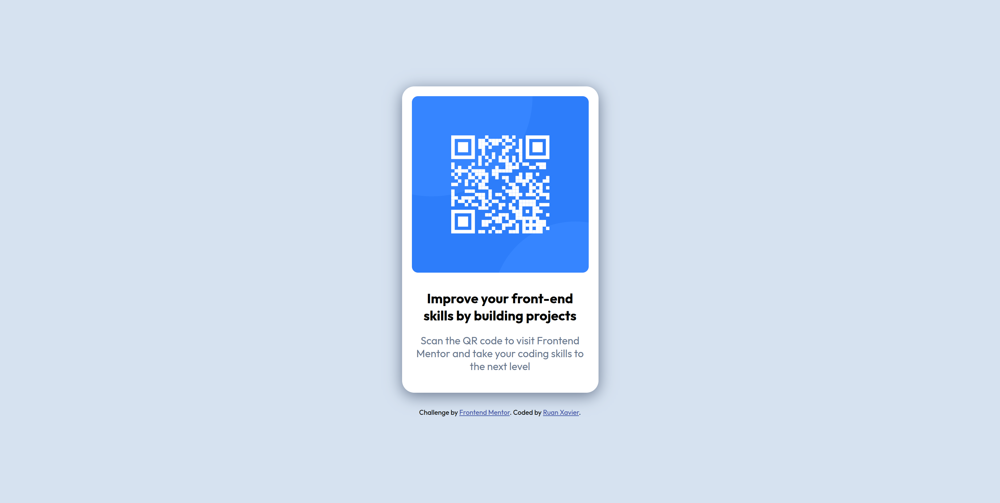

# Frontend Mentor - QR Code Component

Esta é uma solução para o [desafio do componente de QR Code no Frontend Mentor](https://www.frontendmentor.io/challenges/qr-code-component-iux_sIO_H).

## Visão geral

### O desafio

O objetivo é criar um componente de QR Code simples e responsivo, com uma imagem centralizada e texto abaixo explicando o uso do código QR.

### Captura de tela

### Links

- URL da solução: [https://github.com/ruan-xavier/qr-code-component](https://github.com/ruan-xavier/qr-code-component)
- URL do site ao vivo: [https://componente-de-qr-code.netlify.app/](https://componente-de-qr-code.netlify.app/)

## Meu processo

### Construído com

- HTML5
- CSS (Flexbox)
- Google Fonts

### O que aprendi

Aprendi como criar um layout simples e centrado usando `flexbox`, além de trabalhar com imagens e aplicar estilizações de forma limpa e eficaz.

## Autor

- Frontend Mentor - [@ruan-xavier](https://www.frontendmentor.io/profile/ruan-xavier)
- GitHub - [ruan-xavier](https://github.com/ruan-xavier)
- YouTube - [@RuanHenriqueXavier](https://www.youtube.com/@RuanHenriqueXavier)
